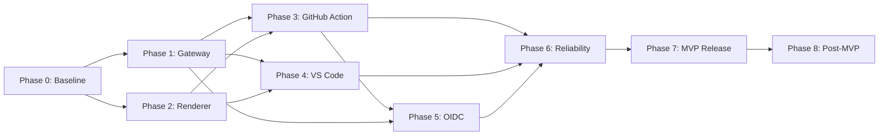

# Kế hoạch triển khai Diagram as Code

## 1. Mục đích

Tài liệu này chuyển các yêu cầu trong `docs/SRS.md`, thiết kế trong `docs/SDD.md` và tiêu chí kiểm thử trong `docs/TestPlan.md` thành kế hoạch triển khai theo phase. Kế hoạch dùng để điều phối backlog, xác định dependency, kiểm soát scope và quyết định khi nào sản phẩm đủ điều kiện phát hành.

Tài liệu không thay thế SRS, SDD, OpenAPI hoặc Test Plan. Nếu có xung đột, thứ tự ưu tiên là SRS, SDD, OpenAPI, Test Plan, sau đó mới đến kế hoạch này.

## 2. Mục tiêu phát hành

### 2.1 MVP hoàn thiện

MVP được xem là hoàn thiện khi một người dùng có thể:

1. Chạy Gateway và bốn renderer MVP bằng Docker Compose.
2. Viết Mermaid, PlantUML/C4, Graphviz/DOT hoặc D2 dưới dạng source text.
3. Preview, xem diagnostic, render-on-save và export bằng VS Code Extension.
4. Dùng GitHub Action ở chế độ `check` hoặc `generate` với API key.
5. Phát hiện source lỗi, output thiếu, stale hoặc orphaned trên pull request.
6. Nhận output SVG ổn định; nhận PNG ở engine công bố hỗ trợ.
7. Vận hành với auth, rate limit, timeout, concurrency limit, cache, health check, log an toàn và SVG sanitization.

OIDC, Redis, playground và auto-commit không chặn MVP trừ khi mentor thay đổi priority.

### 2.2 Bản phát hành hoàn thiện sau MVP

Bản sau MVP bổ sung OIDC cho GitHub Actions, repository policy, metrics đầy đủ, khả năng scale nhiều Gateway instance và các tính năng `Should`. Các yêu cầu `Could` chỉ được đưa vào backlog khi MVP đã đạt exit criteria.

## 3. Nguyên tắc thực hiện

| Nguyên tắc | Cách áp dụng |
|---|---|
| Vertical slice trước | Mỗi phase phải tạo ra một luồng có thể chạy và kiểm thử từ client đến renderer. |
| SRS là baseline | Không hạ requirement để hợp thức hóa code chưa hoàn thiện. |
| Fork Kroki tối thiểu | Auth, rate limit, cache và client policy ở Gateway; chỉ sửa Kroki khi liên quan trực tiếp đến renderer. |
| Contract-first | Thay đổi API phải cập nhật OpenAPI và contract test trước hoặc cùng lúc với code. |
| Secure by default | Không log source/credential; giới hạn body, output, deadline, concurrency và include. |
| Deterministic output | Renderer version, options và sanitizer version phải tham gia stale/cache semantics. |
| PR không ghi mặc định | GitHub Action `check` chỉ đọc repository và không commit. |
| Test theo rủi ro | P0 security, resource protection và dữ liệu người dùng phải có test lỗi lẫn test thành công. |

## 4. Baseline hiện tại

| Khu vực | Đã có | Khoảng trống chính |
|---|---|---|
| Shared config | `.diagram.yml`, Zod parser, JSON Schema, engine override, shared output planner | Cần fixture compatibility và migration/versioning test sâu hơn. |
| Gateway API | Ba render route OpenAPI, health, engine discovery, scoped API-key principal, verifier lifecycle, body/output limit, timeout, bulkhead, partitioned LRU/single-flight, rate limit, sanitizer, structured log và metrics | Phase 1 hoàn thành; engine-level isolation và shared state thuộc phase sau. |
| Renderer | SVG E2E thật cho Mermaid, PlantUML, Graphviz và D2 | Cần PNG E2E, C4/alias test, secure include, version metadata và structured error tốt hơn. |
| VS Code | Live preview, debounce, stale cancellation, SVG export, SecretStorage, shared config | Thiếu diagnostics, PNG export, render-on-save, connection command và preview controls. |
| GitHub Action | API-key render, changed-file planning, missing/stale/orphaned check, summary | Thiếu annotation, artifact, `generate`, failure taxonomy, OIDC và trusted commit policy. |
| Operations | Compose, smoke test, clean build/test, Gateway metrics/log redaction, VSIX và release bundle | Thiếu automated Compose CI gate, performance/security suite và centralized telemetry. |

## 5. Tổng quan các phase

| Phase | Tên | Mục tiêu | Dependency | Ước lượng |
|---:|---|---|---|---:|
| 0 | Khóa baseline | Giữ contract/config/build hiện tại ổn định | Không | Đã hoàn thành |
| 1 | Gateway production baseline | Hoàn thiện trust boundary và resource protection | Phase 0 | 8-12 ngày công |
| 2 | Renderer và Kroki hardening | Đảm bảo bốn engine/format, secure mode và error metadata | Phase 1 một phần | 6-10 ngày công |
| 3 | GitHub Action MVP | Hoàn thiện `check`, artifact, annotation và `generate` | Phase 1, 2 | 8-12 ngày công |
| 4 | VS Code Extension MVP | Hoàn thiện diagnostics, export, render-on-save và UX preview | Phase 1, 2 | 8-12 ngày công |
| 5 | OIDC và policy | Hỗ trợ GitHub public/private không phụ thuộc repository secret | Phase 1, 3 | 8-12 ngày công |
| 6 | Reliability và quality gates | E2E, performance, security và flaky-test control | Phase 1-5 | 6-10 ngày công |
| 7 | Pilot và phát hành | Tài liệu, packaging, upgrade/rollback và pilot repository | Phase 6 | 4-7 ngày công |
| 8 | Sau MVP | Redis, playground, trusted commit và renderer mở rộng | Phase 7 | Lập kế hoạch riêng |

Với nhóm ba người có thể song song hóa phase 3 và 4 sau khi contract của phase 1-2 được khóa. Thời gian lịch dự kiến cho MVP là khoảng 7-10 tuần, tùy mức độ phải sửa Kroki fork và hạ tầng CI.

## 6. Phase 0 - Khóa baseline

### Mục tiêu

Duy trì một điểm xuất phát có thể build, test và render SVG thật trước khi mở rộng tính năng.

### Trạng thái

Đã hoàn thành.

### Deliverable đã đạt

- `.diagram.yml` và JSON Schema dùng chung.
- VS Code Extension và GitHub Action dùng cùng parser/path planner.
- Gateway dùng các route trong `docs/openapi.yaml`.
- SVG E2E qua Compose cho bốn engine MVP.
- Contract test, typecheck, unit/integration test, VSIX và release bundle chạy thành công.
- GitHub Action bundle reproducible.

### Quality gate cần giữ

- `npm ci --prefix product`
- `npm run typecheck --prefix product`
- `npm test --prefix product`
- `npm run build --prefix product`
- `npm audit --prefix product`
- `npm run smoke --prefix product` khi Compose đang chạy

## 7. Phase 1 - Gateway production baseline

### Mục tiêu

Biến Gateway từ functional baseline thành public trust boundary đáp ứng các yêu cầu Must về bảo mật, giới hạn tài nguyên và vận hành.

### Trạng thái

Đã hoàn thành ngày 2026-07-22. Gateway-focused test, product baseline và Compose SVG smoke là bằng chứng bắt buộc của phase gate.

### Work packages

| ID | Công việc | Deliverable | Requirement/Test | Priority |
|---|---|---|---|---|
| P1-01 | Principal hóa API key | `Principal` gồm subject, auth method, scopes và stable partition ID; handler không đọc raw credential sau auth | FR-021..024, TC-SEC-002..004 | P0 |
| P1-02 | Key lifecycle | Cấu hình key có ID/hash/scope/status; hỗ trợ cấp, rotate và revoke qua file/secret vận hành, không cần admin UI | FR-022..024 | P0 |
| P1-03 | Cache isolation | Cache key bổ sung tenant partition và sanitizer version; không chứa source plaintext | FR-010, NFR-SEC-009 | P0 |
| P1-04 | Concurrency bulkhead | Semaphore mặc định 4 render, bounded queue mặc định 20; đầy trả `429 RENDER_CAPACITY_EXCEEDED` | NFR-PERF-007, TC-RATE-003 | P0 |
| P1-05 | Output limit | Chặn response lớn hơn 10 MiB trước cache/response; chuẩn hóa error | NFR-PERF-006 | P0 |
| P1-06 | SVG sanitization | Parse và loại script, event handler, unsafe URI/external reference; sanitizer version tham gia cache key | ADR-009, NFR-SEC-007 | P0 |
| P1-07 | PNG validation | Kiểm tra PNG signature, content type và size trước khi trả/cache | FR-005, NFR-PERF-006 | P0 |
| P1-08 | Structured logging | Log requestId, principal ID, engine, format, duration, status, cache result; redaction source/token | FR-092, FR-093, NFR-SEC-003, NFR-SEC-010 | P0 |
| P1-09 | Metrics | Request, latency, status, timeout, rate-limit, queue, cache hit/miss; endpoint chỉ expose theo profile vận hành | FR-094 | P1 |
| P1-10 | Error contract | Bao phủ malformed body, unsupported media type/option, timeout, unavailable, output-too-large và overload | FR-004, FR-006, FR-014 | P0 |
| P1-11 | Runtime configuration | Environment cho timeout 5-60 giây, source/output size, concurrency, queue và rate limit; fail fast khi sai | FR-095, NFR-PERF-004..008 | P0 |
| P1-12 | Hosted guard | Từ chối no-auth khi bind non-loopback trong production profile; tài liệu TLS reverse proxy | FR-020, NFR-SEC-001 | P0 |

### Trình tự

1. Xây `Principal` và cache partition trước.
2. Thêm bulkhead và output guards quanh `RenderService`.
3. Thêm sanitizer/PNG validator trước cache write.
4. Thêm logging/metrics và redaction tests.
5. Cập nhật Compose, OpenAPI nếu có error mới, SDD và Test Plan.

### Exit criteria

- Các test `TC-SEC-*`, `TC-RATE-*`, `TC-CACHE-*` P0 liên quan API key đều pass.
- Source, API key và Authorization header không xuất hiện trong log fixture.
- Concurrent render không vượt giới hạn cấu hình và mọi permit được release khi timeout/error.
- Unsafe SVG bị sanitize hoặc reject; output sau sanitize mới được hash/cache.
- Gateway fail fast với production config không an toàn.

## 8. Phase 2 - Renderer và Kroki hardening

### Mục tiêu

Đảm bảo backend thật đáp ứng contract cho Mermaid, PlantUML/C4, Graphviz/DOT và D2 mà không đẩy policy sản phẩm vào Kroki.

### Work packages

| ID | Công việc | Deliverable | Requirement/Test | Priority |
|---|---|---|---|---|
| P2-01 | Capability registry | Metadata chính xác theo từng engine: aliases, formats, renderer version và availability | FR-008, FR-033, TC-REN-011 | P0 |
| P2-02 | SVG fixtures | Valid/invalid fixture cho Mermaid, PlantUML, C4-PlantUML, Graphviz, DOT alias và D2 | FR-031, TC-REN-001, 003..008 | P0 |
| P2-03 | PNG fixtures | E2E PNG cho engine hỗ trợ; kiểm tra signature, size và metadata; D2 PNG phải reject | FR-005, FR-032, TC-REN-002..008 | P0 |
| P2-04 | Secure includes | PlantUML/C4 secure mode, remote include tắt; test local/remote include abuse | FR-035, NFR-SEC-006 | P0 |
| P2-05 | Structured errors | Trích line/column khi engine cung cấp; không trả stack trace/internal path | FR-006, FR-036, TC-VAL-009..012 | P0 |
| P2-06 | Timeout cleanup | Xác nhận CLI/browser process bị thu hồi và companion request bị hủy khi deadline | FR-034, NFR-AVL-003 | P0 |
| P2-07 | Health isolation | Companion lỗi chỉ đánh dấu engine liên quan unavailable; readiness theo engine bắt buộc | FR-037, NFR-AVL-002 | P0 |
| P2-08 | Fork patch log | Ghi từng patch Kroki cần thiết, lý do, upstream reference và rebase strategy | FR-039, ADR-002 | P1 |
| P2-09 | Determinism | Cùng source/options/version tạo output ổn định hoặc canonicalized ổn định | FR-033, NFR-AVL-004 | P0 |

### Quy tắc quyết định fork

- Sửa Gateway nếu vấn đề là auth, rate limit, cache, HTTP error normalization hoặc client policy.
- Sửa Kroki nếu vấn đề là engine registry, process execution, companion delegation, renderer version hoặc raw renderer diagnostic.
- Mọi patch Kroki phải có test gần module upstream và mục ghi trong fork patch log.

### Exit criteria

- `TC-REN-001..011` và `TC-VAL-006..012` pass trên Compose reference stack.
- `/api/v1/engines` không công bố format/version sai thực tế.
- Mermaid companion down không làm PlantUML/Graphviz/D2 mất khả dụng nếu kiến trúc cho phép.
- Không còn process/browser bị rò sau timeout test lặp.

## 9. Phase 3 - GitHub Action MVP

### Mục tiêu

Cung cấp workflow PR và generate hoàn chỉnh bằng API key, an toàn cho public/private repository và không tự commit mặc định.

### Contract đầu vào đề xuất

| Input | Mặc định | Ý nghĩa |
|---|---|---|
| `gateway-url` | Bắt buộc | Gateway local/hosted. |
| `api-key` | Rỗng | API key từ GitHub Secret; bắt buộc khi auth mode là API key. |
| `config-path` | `.diagram.yml` | File cấu hình dự án. |
| `mode` | `check` | `check` hoặc `generate`. |
| `changed-only` | `true` trên PR | Chỉ render source bị ảnh hưởng. |
| `artifact-name` | `diagram-previews` | Artifact chứa output đề xuất và manifest. |
| `fail-on-stale` | `true` | Fail khi output thiếu/stale/orphaned. |

### Work packages

| ID | Công việc | Deliverable | Requirement/Test | Priority |
|---|---|---|---|---|
| P3-01 | Input/mode validation | Parser chặt chẽ, message rõ, không nhận path escape | FR-070, FR-082, TC-GHA-013 | P0 |
| P3-02 | Check mode | Missing/stale/orphaned detection; repository không đổi | FR-071, FR-072, FR-074, FR-080 | P0 |
| P3-03 | Renderer diagnostics | `core.error` annotation đúng source, line/column; summary có requestId | FR-073, TC-GHA-002 | P0 |
| P3-04 | Artifact preview | Upload output đề xuất và manifest; không chứa secret hoặc source ngoài glob | FR-075, TC-GHA-003..005 | P0 |
| P3-05 | Generate mode | Atomic write đúng output path; không commit; không để partial output khi một render lỗi | FR-078, TC-GHA-009 | P0 |
| P3-06 | Changed-file planner | PR render file ảnh hưởng; config/lock đổi thì full render; xử lý rename/delete | FR-081, TC-GHA-012 | P1 |
| P3-07 | API-key safety | Mask key, không log request headers, phân biệt auth failure | FR-076, TC-GHA-006 | P0 |
| P3-08 | Failure taxonomy | Message riêng cho 400/401/403/422/429/503/504; dùng Retry-After/requestId | FR-082, TC-GHA-014 | P0 |
| P3-09 | Permission guard | PR mặc định `contents: read`; fork không nhận secret và không có write path | FR-080, TC-GHA-008 | P0 |
| P3-10 | Runner E2E | Fixture repository chạy Action bundle thật với Gateway Compose | TC-GHA-001..006, 008..009 | P0 |

### Exit criteria

- Toàn bộ `TC-GHA-001..006`, `008..009`, `012..014` pass.
- `check` không thay đổi `git status` trong cả success và failure.
- Artifact chỉ chứa generated output, manifest và metadata an toàn.
- Bundle `dist/index.cjs` reproducible và được commit cùng source Action.
- Workflow mẫu hoạt động với private repo/API key và mô tả rõ giới hạn fork PR.

## 10. Phase 4 - VS Code Extension MVP

### Mục tiêu

Hoàn thiện vòng lặp authoring: preview nhanh, lỗi đúng vị trí, export ổn định và render-on-save an toàn.

### Work packages

| ID | Công việc | Deliverable | Requirement/Test | Priority |
|---|---|---|---|---|
| P4-01 | Language coverage | `.mmd`, `.puml`, `.plantuml`, `.dot`, `.d2` ở activation/menu/status bar | FR-050, TC-VSC-001 | P0 |
| P4-02 | Preview lifecycle | Debounce 200-2000 ms, cancel/ignore stale response, panel không tự đóng | FR-051..054, TC-VSC-002..003 | P0 |
| P4-03 | Diagnostics | DiagnosticCollection và Problems entries theo line/column; clear khi render thành công | FR-055, FR-056, TC-VSC-004 | P0 |
| P4-04 | Export SVG/PNG | Chọn format được hỗ trợ, atomic write qua shared output planner, không ghi ngoài workspace | FR-057, TC-VSC-005 | P0 |
| P4-05 | Render-on-save | Tôn trọng `.diagram.yml`; mặc định tắt; lỗi không ghi đè output cũ | FR-058, TC-VSC-006..007 | P0 |
| P4-06 | Gateway settings | Local/hosted URL theo workspace; API key trong SecretStorage/env; không ở project config | FR-059, FR-060, TC-VSC-010 | P0 |
| P4-07 | Connection command | Gọi health/engines, hiển thị availability và lỗi có hành động khắc phục | FR-061, TC-VSC-009 | P1 |
| P4-08 | Preview controls | Zoom in/out, fit-to-view, reset; giữ CSP chặt | FR-062 | P1 |
| P4-09 | Shared fixture | Cùng source/config với Action phải tạo cùng request/output path | FR-042, FR-045, TC-VSC-008 | P0 |
| P4-10 | Extension-host E2E | Chạy VS Code test host với mock Gateway và một smoke với Gateway thật | TC-VSC-* | P0 |

### Exit criteria

- `TC-VSC-001..010` pass, trừ phần `Should` được ghi rõ nếu chuyển phase.
- Preview không nhấp nháy về response cũ khi gõ nhanh.
- Syntax error xuất hiện đúng file/dòng và biến mất sau lần render thành công.
- Export/render-on-save không tạo file partial hoặc ghi đè output tốt khi render lỗi.
- VSIX cài được trên VS Code version tối thiểu và một version stable hiện hành.

## 11. Phase 5 - GitHub OIDC và repository policy

### Mục tiêu

Cho GitHub Action gọi hosted Gateway mà không cần repository secret, đồng thời xử lý public/private repository bằng cùng policy dựa trên immutable claims.

### Work packages

| ID | Công việc | Deliverable | Requirement/Test | Priority |
|---|---|---|---|---|
| P5-01 | OIDC trust config | Issuer, audience, JWKS cache/rotation và clock skew cấu hình được | FR-025 | P1 |
| P5-02 | Claims validation | Validate signature, issuer, audience, expiry, repository ID, workflow ref, event và ref | FR-025, TC-SEC-005 | P1 |
| P5-03 | Repository policy | Allowlist theo immutable repository ID; policy riêng cho PR, push và workflow | FR-026 | P1 |
| P5-04 | Token strategy | Quyết định trực tiếp dùng OIDC principal hoặc exchange access token ngắn hạn; ghi ADR nếu đổi SDD | ADR-008 | P1 |
| P5-05 | Action auth provider | Ưu tiên OIDC khi được bật; API key fallback rõ ràng; không dùng PAT | FR-077, FR-028 | P1 |
| P5-06 | Public/private fixtures | E2E repo public, private, fork PR, wrong audience, wrong workflow và revoked policy | TC-GHA-007..008 | P1 |
| P5-07 | Auditability | Log principal/repository ID và policy decision nhưng không log JWT | FR-093 | P1 |

### Exit criteria

- Valid workflow public/private render được mà không cần PAT hoặc repository API-key secret.
- Token sai issuer/audience/expiry/repository/workflow bị từ chối.
- Fork PR không nhận credential có quyền ngoài policy.
- JWKS rotation và transient fetch failure có behavior/test xác định.

## 12. Phase 6 - Reliability, performance và quality gates

### Mục tiêu

Chứng minh hệ thống ổn định trong điều kiện tải, lỗi dependency và quy trình CI lặp lại.

### Work packages

| ID | Công việc | Deliverable | Requirement/Test | Priority |
|---|---|---|---|---|
| P6-01 | Compose acceptance | CI dựng Gateway/Kroki/Mermaid, chạy bốn engine SVG, PNG hỗ trợ, text POST và encoded GET | TC-REN-* | P0 |
| P6-02 | Dependency failure | Kill/restart companion, timeout backend, cache failure; xác nhận recovery/readiness | NFR-AVL-002, NFR-AVL-003, NFR-AVL-005, TC-OPS-* | P0 |
| P6-03 | Performance suite | Đo health, cache hit, valid render và workspace 100 diagram theo NFR | NFR-PERF-001..010 | P0/P1 |
| P6-04 | Concurrency soak | Burst/rate/bulkhead test dài; theo dõi memory, process, browser và permit leak | NFR-PERF-007..008 | P0 |
| P6-05 | Security suite | Malformed body, decompression bomb, path traversal, unsafe SVG/include, secret redaction | NFR-SEC-003, NFR-SEC-005..010 | P0 |
| P6-06 | Determinism suite | Render fixture lặp, restart stack, rebuild image và so hash/canonical output | FR-074, NFR-AVL-004 | P0 |
| P6-07 | Flaky control | Lặp unit/integration, timeout budget, lưu report; quarantine không được dùng cho P0 | Test Plan 2.2 | P0 |
| P6-08 | CI matrix | Node 24, Java 25, Linux runner; Windows cho Extension/path tests | Constraints/Test Environment | P0 |
| P6-09 | Supply chain | Audit dependency, image scan, SBOM/checksum, pinned Action/image references | NFR-SEC-005, NFR-CMU-003 | P1 |

### Exit criteria

- Tất cả P0 trong `docs/TestPlan.md` pass trên reference environment.
- Không có vulnerability Critical/High chưa được chấp nhận bằng quyết định có thời hạn.
- NFR Must đạt hoặc có báo cáo sai lệch được mentor chấp thuận.
- Ba lần full CI liên tiếp xanh; bundle và generated output reproducible.
- Recovery test không cần can thiệp thủ công ngoài restart policy đã ghi tài liệu.

## 13. Phase 7 - Pilot và phát hành MVP

### Mục tiêu

Đưa sản phẩm vào một repository thật với hướng dẫn setup ngắn, có khả năng rollback và dữ liệu phản hồi.

### Work packages

| ID | Công việc | Deliverable | Priority |
|---|---|---|---|
| P7-01 | Version lock | Pin Gateway, Kroki, companion và schema version; tạo manifest/checksum | P0 |
| P7-02 | Installation docs | Compose, reverse proxy/TLS, API key, VSIX, Action workflow, `.diagram.yml` | P0 |
| P7-03 | Operations runbook | Health, logs, metrics, key rotation, backup config, upgrade và rollback | P0 |
| P7-04 | Pilot repository | Ít nhất một repo có bốn engine, PR stale/error case và VS Code workflow | P0 |
| P7-05 | Acceptance session | Demo theo use case SRS; lưu issue và quyết định scope còn lại | P0 |
| P7-06 | Release artifacts | Gateway image, Compose, VSIX, Action bundle, example config, SBOM/checksum, release notes | P0 |
| P7-07 | Go/no-go review | Security, NFR, test report, known limitations và rollback owner | P0 |

### Exit criteria

- Người mới có thể setup local trong tối đa 30 phút theo tài liệu mà không đọc source code.
- Pilot PR hiển thị source diff, generated image diff và Action check đúng.
- Upgrade và rollback được diễn tập bằng artifact versioned.
- Known limitations được công bố; không có P0/P1 blocker mở.

## 14. Phase 8 - Sau MVP

Các hạng mục này không nằm trên critical path MVP:

| Hạng mục | Điều kiện bắt đầu | Ghi chú |
|---|---|---|
| Redis cache/rate store | Cần nhiều Gateway replica hoặc cache hit rate có giá trị vận hành | Phải giữ in-memory adapter cho local. |
| Trusted auto-commit | `generate` ổn định và policy branch/repository được duyệt | Chỉ stage generated outputs/manifest; không sửa source. |
| Playground UI | Gateway API/security ổn định | Không được tạo API riêng khác contract. |
| Markdown fenced-block preview | Extension MVP ổn định | `Could`, không làm chậm file-based workflow. |
| BPMN/PDF/renderer khác | Bốn engine MVP đạt SLO | Mỗi engine cần capability, fixture và security review. |
| Kubernetes/HA | Có nhu cầu deployment thực | Cần Redis/shared policy store và readiness semantics rõ. |

## 15. Dependency và khả năng song song hóa

### Phân công gợi ý cho nhóm ba người

| Luồng | Trách nhiệm chính |
|---|---|
| Backend/Platform | Gateway, auth, cache, bulkhead, sanitization, observability và Compose. |
| Renderer/QA | Kroki fork, renderer fixtures, secure mode, determinism, E2E/performance/security. |
| Toolchain | GitHub Action, VS Code Extension, shared config, packaging và setup docs. |

Trong phase 1-2, Toolchain chuẩn bị fixture/client contract nhưng không phát triển dựa trên API chưa khóa. Sau contract freeze, phase 3 và 4 chạy song song.

## 16. Definition of Done cho mọi work package

Một work package chỉ được hoàn thành khi:

- Có code/config hoặc tài liệu deliverable đúng mô tả.
- Có unit test cho logic và integration/E2E test tương ứng với blast radius.
- Không làm sai requirement hoặc ADR hiện hành.
- OpenAPI, SDD và Test Plan được cập nhật khi contract/architecture/test baseline thay đổi.
- Không có secret, private source, temporary output hoặc log nhạy cảm trong Git.
- Typecheck, test và build liên quan đều pass.
- Error path, timeout và cleanup đã được kiểm tra, không chỉ happy path.
- User-facing behavior có hướng dẫn sử dụng và changelog khi đã phát hành được.
- Reviewer có thể truy ngược work package đến FR/NFR/Test Case.

## 17. Quản lý rủi ro

| Rủi ro | Tác động | Giảm thiểu | Trigger cần quyết định |
|---|---|---|---|
| Deep fork Kroki khó rebase | Trễ nâng version/security patch | Giữ patch nhỏ, patch log, ưu tiên adapter/Gateway | Patch chạm nhiều module upstream hoặc không có test cô lập. |
| Renderer output không deterministic | Action báo stale giả | Pin version/options, canonicalization, manifest | Cùng input/version vẫn đổi output sau restart. |
| Chromium/CLI dùng quá nhiều tài nguyên | Gateway timeout hoặc host mất ổn định | Bulkhead, process/browser limits, queue, soak test | Memory/process tăng liên tục hoặc p95 vượt NFR. |
| Secret lộ ở fork PR/log/artifact | Sự cố bảo mật nghiêm trọng | OIDC/policy, masking, read-only default, security tests | Bất kỳ credential/source private xuất hiện trong log/artifact. |
| Config drift giữa client | Local pass nhưng CI fail | Một package parser/planner và shared fixtures | VS Code/Action tạo request hoặc output path khác nhau. |
| Scope phình trước MVP | Không có bản demo hoàn chỉnh | Must trước, Should sau; phase gate | Thêm playground/PDF/renderer khi P0 còn mở. |
| In-memory state khi scale | Rate/cache không nhất quán | Một replica MVP, adapter Redis sau số liệu | Yêu cầu HA hoặc nhiều replica production. |
| CI E2E tốn thời gian | Feedback chậm/flaky | Tách PR smoke và nightly soak, cache image | PR gate thường xuyên vượt 15 phút hoặc flaky. |

## 18. Báo cáo tiến độ

Mỗi phase duy trì một bảng trạng thái ngắn trong issue/milestone, không sửa lịch sử requirement:

| Trường | Nội dung |
|---|---|
| Status | Not started / In progress / Blocked / Done |
| Owner | Người chịu trách nhiệm cuối cùng |
| Requirements | FR/NFR liên quan |
| Tests | Test case tự động/thủ công và kết quả gần nhất |
| Risks | Rủi ro mới hoặc thay đổi mức độ |
| Decision | ADR/product decision cần mentor xác nhận |
| Evidence | PR, CI run, artifact, benchmark hoặc demo |

Cuối mỗi phase cần review exit criteria và quyết định `Go`, `Conditional Go` hoặc `No-Go`. `Conditional Go` phải có owner, deadline và phạm vi ảnh hưởng; không dùng để bỏ qua P0 security/data-integrity blocker.

## 19. Thứ tự công việc ngay tiếp theo

Backlog bắt đầu nên theo thứ tự:

1. `P2-01` capability/version metadata và `P2-03` PNG E2E.
2. `P2-04` secure includes và `P2-06` timeout cleanup ở renderer.
3. Khóa Gateway/renderer contract cho phase 3 và 4.
4. Chạy song song GitHub Action MVP và VS Code Extension MVP.

Không bắt đầu OIDC trước khi API-key principal, scope và policy boundary của phase 1 ổn định.
