# Software Design Document

## Diagram as Code - Rendering Service and Toolchain

| Thuộc tính | Giá trị |
|---|---|
| Tài liệu | Software Design Document (SDD) |
| Phiên bản | 1.0 |
| Trạng thái | Bản nháp thiết kế từ SRS 1.0 |
| SRS nguồn | [`docs/SRS.md`](./SRS.md) |
| Phạm vi | MVP và các điểm mở rộng `Should` đã được định hướng |
| Ngày | 2026-07-22 |

## 1. Mục đích và nguyên tắc thiết kế

Tài liệu này chuyển các yêu cầu trong SRS thành kiến trúc triển khai cho Diagram Gateway, Kroki fork, renderer workers, cache, VS Code Extension và GitHub Action.

| Nguyên tắc | Diễn giải |
|---|---|
| Một API công khai | Client chỉ gọi Diagram Gateway; Kroki và renderer worker không được expose ra Internet. |
| Source là nguồn sự thật | Diagram source được version bằng Git; ảnh là đầu ra có thể tái tạo. |
| Fork Kroki tối thiểu | Ưu tiên cấu hình hoặc xử lý tại Gateway; chỉ patch Kroki khi liên quan trực tiếp đến rendering. |
| Đồng bộ trước, bất đồng bộ bên trong | Client nhận kết quả trong một HTTP request; giới hạn concurrency bằng bulkhead/process pool, không dùng message broker ở MVP. |
| Cấu hình dùng chung | VS Code Extension và GitHub Action dùng cùng `.diagram.yml` và JSON Schema. |
| Quyền tối thiểu | VS Code dùng no-auth/API key; GitHub Action dùng API key, sau đó mở rộng OIDC; PR check không có quyền ghi. |
| Fail có cấu trúc | Mọi lỗi đi qua error model thống nhất, có `requestId` và vị trí source nếu renderer cung cấp. |
| Có thể thay thế hạ tầng | Cache, credential repository và backend resolver được đặt sau interface. |

## 2. Kiến trúc tổng thể

### 2.1 C4 Level 1 - System Context

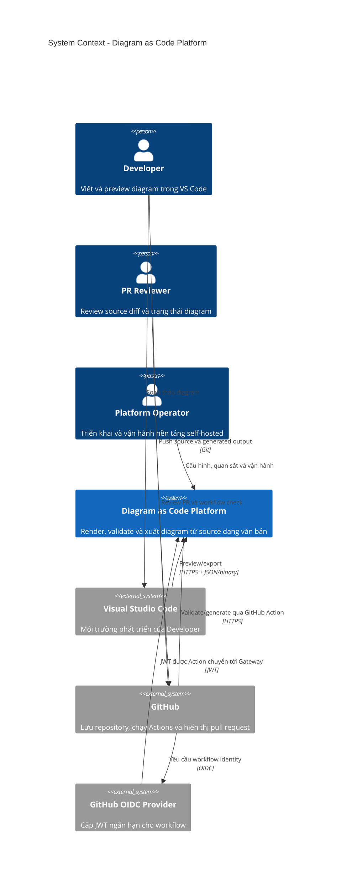

### 2.2 C4 Level 2 - Container

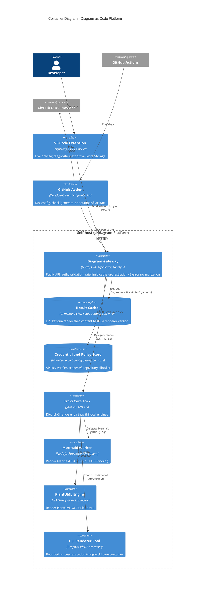

### 2.3 C4 Level 3 - Diagram Gateway Components

```mermaid
C4Component
    title Component Diagram - Diagram Gateway

    Container_Ext(vscodeExt, "VS Code Extension", "TypeScript")
    Container_Ext(githubAction, "GitHub Action", "TypeScript")
    Container_Ext(kroki, "Kroki Core Fork", "HTTP rendering backend")
    ContainerDb_Ext(cache, "Result Cache", "In-memory LRU/Redis")
    ContainerDb_Ext(policyStore, "Credential and Policy Store", "Config/secret store")

    Container_Boundary(gateway, "Diagram Gateway") {
        Component(httpApi, "HTTP API and Router", "Fastify 5", "Route versioning, body limits, content negotiation và request ID")
        Component(auth, "Authentication Service", "Authenticator chain", "No-auth local, API key và GitHub OIDC")
        Component(authorizer, "Policy Authorizer", "Policy rules", "Kiểm tra scope, repository, workflow và cache isolation")
        Component(rateLimiter, "Rate Limiter", "Token bucket", "Giới hạn theo principal hoặc IP")
        Component(normalizer, "Request Normalizer", "Validation and canonicalization", "Chuẩn hóa engine, format, source, theme và options")
        Component(cacheService, "Cache Service", "ResultCache port", "Tạo cache key, single-flight, get/put và no-store")
        Component(renderService, "Render Orchestrator", "Async service", "Bulkhead, timeout, backend selection và retry policy")
        Component(krokiClient, "Kroki HTTP Client", "Node.js Fetch API", "Gọi Kroki qua HTTP nội bộ")
        Component(svgSanitizer, "SVG Sanitizer", "Allowlist policy", "Loại active content và external resources")
        Component(errorMapper, "Error Mapper", "Renderer adapters", "Chuyển lỗi Kroki/worker thành error contract chung")
        Component(observability, "Observability", "OpenTelemetry and metrics", "Structured logs, traces và metrics không chứa source")
    }

    Rel(vscodeExt, httpApi, "Gọi API", "HTTPS")
    Rel(githubAction, httpApi, "Gọi API", "HTTPS")
    Rel(httpApi, auth, "Credential")
    Rel(auth, policyStore, "Đọc verifier/policy")
    Rel(auth, authorizer, "Principal")
    Rel(authorizer, rateLimiter, "Authorized request")
    Rel(rateLimiter, normalizer, "Accepted request")
    Rel(normalizer, cacheService, "Canonical request")
    Rel(cacheService, cache, "Get/put")
    Rel(cacheService, renderService, "Cache miss")
    Rel(renderService, krokiClient, "Render command")
    Rel(krokiClient, kroki, "POST source", "HTTP")
    Rel(renderService, svgSanitizer, "SVG output")
    Rel(renderService, errorMapper, "Backend error")
    Rel(httpApi, observability, "Request lifecycle")
```

### 2.4 Mô hình triển khai tham chiếu

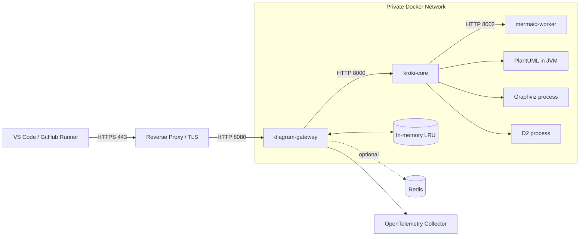

Chỉ reverse proxy/Gateway được publish port. Kroki và workers dùng private container network. Với local development, có thể bỏ reverse proxy và expose Gateway tại `http://localhost:9000`.

## 3. Thiết kế chi tiết từng component

### 3.1 Diagram Gateway

#### 3.1.1 Công nghệ và cấu trúc module

Gateway là một service Node.js 24 riêng, viết bằng TypeScript và Fastify 5. Kroki fork tiếp tục dùng Java; ranh giới HTTP giữ cho hai runtime độc lập, cho phép Gateway chia sẻ contract và package cấu hình với VS Code Extension và GitHub Action.

```text
product/gateway/
├── src/
│   ├── app.ts            Fastify application, routes và lifecycle hooks
│   ├── config.ts         Environment/config mapping
│   ├── render-service.ts Render orchestration, cache và single-flight
│   ├── renderer.ts       Kroki HTTP adapter và structured renderer errors
│   ├── server.ts         Process bootstrap
│   ├── auth/             Authenticator, principal, API key và OIDC
│   ├── policy/           Scope và repository/workflow policies
│   ├── ratelimit/        Token bucket và key resolver
│   ├── cache/            ResultCache port, in-memory/Redis adapters
│   ├── sanitize/         SVG output policy
│   └── observability/    Logging, metrics và tracing
└── test/                 Unit và HTTP contract tests
```

Các file phẳng hiện có là baseline triển khai ban đầu; các thư mục chức năng được tách dần khi bổ sung policy, rate limit, sanitizer và observability. Không chuyển các trách nhiệm này vào Kroki chỉ để tránh tạo module trong Gateway.

#### 3.1.2 Routing

| Method | Path | Content type | Mục đích |
|---|---|---|---|
| `POST` | `/api/v1/render` | `application/json` | API chuẩn cho VS Code và GitHub Action |
| `POST` | `/api/v1/render/{engine}/{format}` | `text/plain` | API nguồn văn bản tương thích Kroki |
| `GET` | `/api/v1/render/{engine}/{format}/{encoded}` | N/A | Deflate + Base64 URL-safe |
| `GET` | `/api/v1/engines` | `application/json` | Engine, format, availability và version |
| `GET` | `/health/live` | `application/json` | Process đang sống; không gọi renderer |
| `GET` | `/health/ready` | `application/json` | Gateway và backend thiết yếu sẵn sàng |
| `POST` | `/api/v1/auth/github/exchange` | `application/json` | Đổi GitHub OIDC JWT lấy access token ngắn hạn; `Should` |

Pipeline xử lý route:

```text
Request ID
  -> header/body-size guard
  -> authentication
  -> authorization
  -> rate limit
  -> decode và request validation
  -> canonical normalization
  -> cache lookup/single-flight
  -> render bulkhead
  -> Kroki backend
  -> output validation/SVG sanitization
  -> cache write
  -> HTTP response + metrics
```

Request bị từ chối càng sớm càng tốt trước khi giữ render slot. Body được đọc có giới hạn streaming; source sau decode cũng phải được kiểm tra lại để chống compressed payload vượt `1 MiB`.

#### 3.1.3 Authentication và authorization

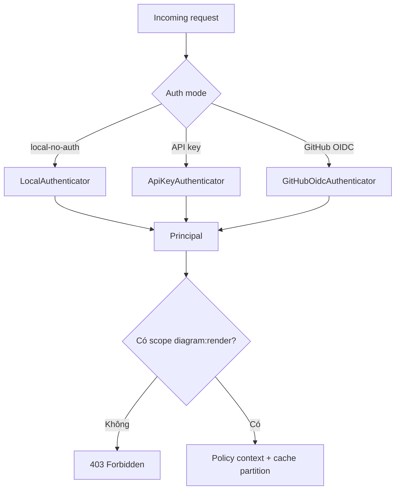

| Thành phần | Thiết kế |
|---|---|
| `Authenticator` | Interface `authenticate(RequestContext) -> Principal`. |
| `LocalAuthenticator` | Chỉ bật bằng config trong local profile; tạo principal cố định `local`. |
| `ApiKeyAuthenticator` | Đọc opaque bearer key dạng `dg_<random>`; băm SHA-256 và constant-time compare với các verifier record. Raw key không đi qua pipeline sau bước xác thực. |
| `GitHubOidcAuthenticator` | Verify JWT signature từ GitHub JWKS, `iss`, custom `aud`, `exp/nbf`, `repository_id`, `workflow_ref`, `event_name`. |
| `Principal` | Chứa `subject`, `authMethod`, `scopes`, `tenantId`, `repositoryId`, `visibility` và `requestPolicy`. |
| `PolicyAuthorizer` | Kiểm tra scope và allowlist; không chứa logic render. |

API key plaintext chỉ xuất hiện khi cấp. Credential store lưu verifier, trạng thái, scopes và metadata. MVP có thể dùng mounted secret/config do admin quản lý; interface `CredentialRepository` cho phép chuyển sang database hoặc secret manager mà không đổi pipeline.

OIDC là adapter bổ sung, không phải hệ thống auth thứ hai. Endpoint exchange cấp token nội bộ có TTL 5-10 phút và scope duy nhất `diagram:render`; GitHub JWT không được chuyển xuống Kroki.

#### 3.1.4 Rate limit và admission control

| Cơ chế | Mục đích | Baseline |
|---|---|---|
| Token bucket | Chặn burst theo principal; fallback theo IP trước auth | 60 request/phút, burst 10 |
| Global bulkhead | Không nhận nhiều render hơn sức chứa | 4 concurrent render/Gateway instance |
| Engine bulkhead | Cô lập renderer nặng | Mermaid 2; CLI/JVM tổng 4, cấu hình được |
| Pending queue | Hấp thụ burst ngắn | Tối đa 20 request; hết chỗ trả `429` |
| Render timeout | Giải phóng slot khi backend treo | 15 giây mặc định |

MVP dùng token bucket in-memory. Khi chạy nhiều Gateway instance, Redis-backed limiter là adapter `Should`; nếu chưa có Redis, rate limit được hiểu theo từng instance và phải ghi rõ trong deployment guide.

Response khi rate-limit:

```http
HTTP/1.1 429 Too Many Requests
Retry-After: 2
X-Request-Id: req_01J...
Content-Type: application/problem+json
```

#### 3.1.5 Render orchestration

`RenderService` nhận `CanonicalRenderRequest`, không nhận trực tiếp DTO HTTP. Trình tự:

1. Lấy renderer version snapshot từ `EngineRegistry`.
2. Tạo cache key và kiểm tra cache.
3. Dùng single-flight để các request cùng key chờ một render đang chạy.
4. Acquire global và engine bulkhead với deadline.
5. Gọi Kroki bằng HTTP, chuyển cancellation/deadline xuống WebClient.
6. Kiểm tra content type và response size tối đa `10 MiB`.
7. Sanitize SVG; PNG được kiểm tra signature cơ bản.
8. Ghi cache nếu policy cho phép.
9. Trả `RenderResult` hoặc ném domain error cho `ErrorMapper`.

Không tự động retry syntax error. Với lỗi kết nối xảy ra trước khi backend nhận body, có thể retry một lần sang replica Kroki khác nếu còn đủ deadline. Không retry timeout vì renderer có thể vẫn đang tiêu thụ tài nguyên.

#### 3.1.6 Error mapping

| Nguồn lỗi | HTTP | `code` chuẩn |
|---|---:|---|
| JSON/text/source không hợp lệ | 400 | `INVALID_REQUEST` |
| Engine hoặc format không hỗ trợ | 400 | `UNSUPPORTED_ENGINE`, `UNSUPPORTED_FORMAT` |
| Renderer syntax error | 422 | `DIAGRAM_SYNTAX_ERROR` |
| Thiếu/sai credential | 401 | `UNAUTHENTICATED` |
| Không đủ scope/policy | 403 | `FORBIDDEN` |
| Source quá lớn | 413 | `PAYLOAD_TOO_LARGE` |
| Rate limit hoặc bulkhead đầy | 429 | `RATE_LIMITED`, `RENDER_CAPACITY_EXCEEDED` |
| Output quá lớn hoặc sai SVG/PNG/content type | 502 | `RENDER_OUTPUT_TOO_LARGE`, `INVALID_RENDER_OUTPUT` |
| Kroki/worker unavailable | 503 | `RENDERER_UNAVAILABLE` |
| Render quá deadline | 504 | `RENDER_TIMEOUT` |
| Lỗi không phân loại | 500 | `INTERNAL_ERROR` |

Stack trace và source không được đưa vào response production. `requestId` cho phép truy vết log nội bộ.

### 3.2 Kroki fork và renderer workers

#### 3.2.1 Vai trò của Kroki fork

Kroki fork là rendering backend nội bộ. Gateway không gọi trực tiếp từng engine; Kroki giữ registry engine, cơ chế decode, command execution và companion delegation hiện có.

Các thay đổi được phép trong fork:

| Nhóm thay đổi | Ví dụ |
|---|---|
| Security defaults | PlantUML secure mode, tắt remote include, hạn chế filesystem/network. |
| Structured errors | Trích line/column/name từ Mermaid, PlantUML, Graphviz và D2 nếu có. |
| Metadata | Trả engine/version/format qua health/metadata endpoint nội bộ. |
| Resource control | Per-engine timeout và bounded command executor. |
| Reproducibility | Pin renderer/package/container version. |
| New engine | Chỉ thêm khi được ưu tiên sau MVP. |

Auth, rate limit, cache tenant và GitHub policy không được đặt trong Kroki fork.

#### 3.2.2 Mô hình worker hybrid

| Engine | Runtime | Isolation MVP | Giao tiếp từ Kroki | Lý do |
|---|---|---|---|---|
| PlantUML/C4 | Java library | Trong `kroki-core` JVM; container CPU/RAM limit | In-process API | Kroki đã tích hợp sâu; tránh thêm service và serialization. |
| Graphviz/DOT | Native CLI | Child process trong `kroki-core`; bounded process pool | stdin/stdout/stderr | Process ngắn hạn, dễ timeout/kill, không cần HTTP wrapper mới. |
| D2 | Native CLI | Child process trong `kroki-core`; bounded process pool | stdin/stdout/stderr | Cùng mô hình Commander hiện có. |
| Mermaid | Node.js + Chromium | Companion container `mermaid-worker` | HTTP `POST /svg` hoặc `/png` | Chromium nặng, dependency khác JVM và cần isolation riêng. |

Mô hình này containerize theo đặc tính runtime, không máy móc một container cho mỗi tên engine. Khi tải hoặc yêu cầu bảo mật tăng, Graphviz/D2 có thể được tách thành HTTP worker sau `RendererAdapter` mà không đổi Gateway API.

#### 3.2.3 Internal renderer protocol

Gateway gọi Kroki bằng HTTP đồng bộ trong private network:

```http
POST /mermaid/svg HTTP/1.1
Host: kroki-core:8000
Content-Type: text/plain; charset=utf-8
Accept: image/svg+xml
Kroki-Diagram-Options-theme: default
X-Request-Id: req_01J...

graph TD
  A --> B
```

Kroki gọi Mermaid worker:

```http
POST /svg?theme=default HTTP/1.1
Host: mermaid-worker:8002
Content-Type: text/plain; charset=utf-8
X-Request-Id: req_01J...

graph TD
  A --> B
```

Internal calls không dùng end-user credential. Network policy chỉ cho phép Gateway gọi Kroki và Kroki gọi worker. `X-Request-Id` được truyền xuyên suốt để liên kết trace.

#### 3.2.4 Process pool và timeout

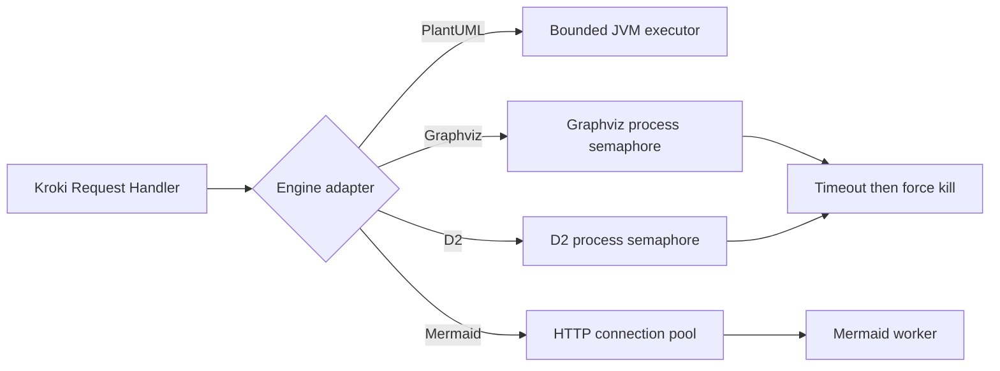

Mỗi adapter có semaphore riêng. Lệnh CLI nhận source qua stdin, không xây shell command từ source. Khi timeout, process bị terminate rồi force-kill; stdout/stderr có giới hạn để tránh memory exhaustion.

#### 3.2.5 Health model

| Endpoint | Kiểm tra | Dùng cho |
|---|---|---|
| Kroki `/health/live` | Event loop/process còn sống | Container liveness |
| Kroki `/health/ready` | Registry khởi tạo và engine bắt buộc có binary/library | Readiness |
| Worker `/health/live` | HTTP process/Chromium supervisor sống | Worker liveness |
| Worker `/health/ready` | Render sample nhỏ hoặc browser page sẵn sàng | Worker readiness |
| Gateway `/api/v1/engines` | Tổng hợp version và availability | Client capability discovery |

Gateway không cache engine availability quá 30 giây. Một worker lỗi chỉ đánh dấu engine liên quan unavailable.

### 3.3 Cache layer

#### 3.3.1 Cache abstraction

```typescript
interface ResultCache {
  get(key: CacheKey): Promise<CachedRender | undefined>;
  put(key: CacheKey, value: CachedRender, ttlMs: number): Promise<void>;
  invalidate(key: CacheKey): Promise<void>;
}
```

| Adapter | Giai đoạn | Đặc điểm |
|---|---|---|
| `InMemoryResultCache` | MVP | In-process LRU/weighted eviction, latency thấp, không cần hạ tầng ngoài. |
| `RedisResultCache` | Sau MVP/scale ngang | Cache dùng chung nhiều Gateway instance, TTL native. |
| `NoOpResultCache` | Troubleshooting | Tắt cache rõ ràng; không dùng làm production default. |

#### 3.3.2 Cache key

Không dùng source thô làm key. Gateway tạo canonical JSON với key được sắp xếp và giá trị mặc định đã được materialize:

```json
{
  "schemaVersion": 1,
  "tenantPartition": "public-or-tenant-id",
  "engine": "mermaid",
  "rendererVersion": "11.15.0",
  "format": "svg",
  "sourceSha256": "f9f9...",
  "options": {
    "theme": "default"
  },
  "sanitizerVersion": "1"
}
```

Cache key thực tế là:

```text
render:v1:<SHA-256(canonical-json)>
```

`tenantPartition` ngăn cache private bị chia sẻ ngoài policy. Với public/no-auth local có thể dùng partition `public`. Renderer version và sanitizer version làm cache tự vô hiệu khi output semantics thay đổi.

#### 3.3.3 Cache entry và chính sách

| Trường | Mô tả |
|---|---|
| `body` | Binary SVG/PNG đã validate/sanitize |
| `contentType` | `image/svg+xml` hoặc `image/png` |
| `etag` | SHA-256 của output cuối cùng |
| `engine` / `rendererVersion` | Metadata để debug và response headers |
| `createdAt` / `expiresAt` | Thời gian tạo và hết hạn |
| `size` | Dùng cho weighted eviction |

Baseline MVP: TTL 24 giờ, maximum weight 256 MiB/instance và không cache response lớn hơn 5 MiB. Các giá trị cấu hình được. Syntax error không được cache ở MVP. `Cache-Control: no-store` hoặc policy private `noStore` làm bỏ qua cả read và write.

Single-flight map theo cache key ngăn cache stampede; entry single-flight bị xóa trong `finally`, kể cả khi render lỗi.

### 3.4 VS Code Extension

| Component | Trách nhiệm |
|---|---|
| `ConfigurationService` | Đọc `.diagram.yml`, VS Code settings và xác định precedence. |
| `GatewayClient` | Health, engine discovery, render, timeout và auth header. |
| `PreviewController` | Quản lý webview, debounce, cancellation và sequence number. |
| `DiagnosticManager` | Map normalized error sang `DiagnosticCollection`. |
| `ExportService` | Ghi SVG/PNG atomically vào output path. |
| `SecretService` | Đọc/ghi API key qua VS Code SecretStorage. |
| `FileTypeResolver` | Ánh xạ extension sang engine và áp override từ config. |

Cấu hình precedence:

```text
Command invocation
  > VS Code workspace/user settings cho Gateway và UX
  > per-file/per-engine rule trong .diagram.yml
  > defaults trong .diagram.yml
  > extension defaults
```

Gateway URL và API key không nằm trong `.diagram.yml`. Webview nhận SVG đã sanitize dưới dạng image resource; CSP mặc định `default-src 'none'`, chỉ mở script/style bundled và image resource của extension.

### 3.5 GitHub Action

| Component | Trách nhiệm |
|---|---|
| `ConfigLoader` | Đọc và validate `.diagram.yml` bằng shared schema/package. |
| `ChangeDetector` | Xác định source thay đổi trên PR; full scan trên main/manual. |
| `AuthProvider` | API key hoặc GitHub OIDC exchange. |
| `GatewayClient` | Gọi cùng render API với VS Code. |
| `OutputPlanner` | Tính deterministic output path. |
| `CheckRunner` | Render, so sánh byte/hash và phát hiện stale output. |
| `AnnotationReporter` | Ghi lỗi file/line và job summary. |
| `ArtifactPublisher` | Upload output mới khi check lỗi hoặc theo cấu hình. |
| `GenerateRunner` | Ghi output; không tự commit trừ khi `commit: true`. |

Action được viết bằng TypeScript và bundle thành một JavaScript artifact để người dùng không phải cài dependency. `check` là mode mặc định và chỉ cần `contents: read`; OIDC thêm `id-token: write`. Logic commit là adapter tùy chọn, không nằm trong render core.

### 3.6 Shared configuration package

Repository nên có package TypeScript dùng chung cho Extension và Action:

```text
tooling/config/
├── schema/diagram-config.schema.json
├── src/parser.ts
├── src/path-planner.ts
├── src/engine-map.ts
└── test/
```

Gateway không cần đọc `.diagram.yml`; nó nhận request đã được client chuyển thành contract API. JSON Schema là nguồn sự thật cho validation editor và CI.

## 4. Luồng xử lý

### 4.1 Live preview trong VS Code - cache miss

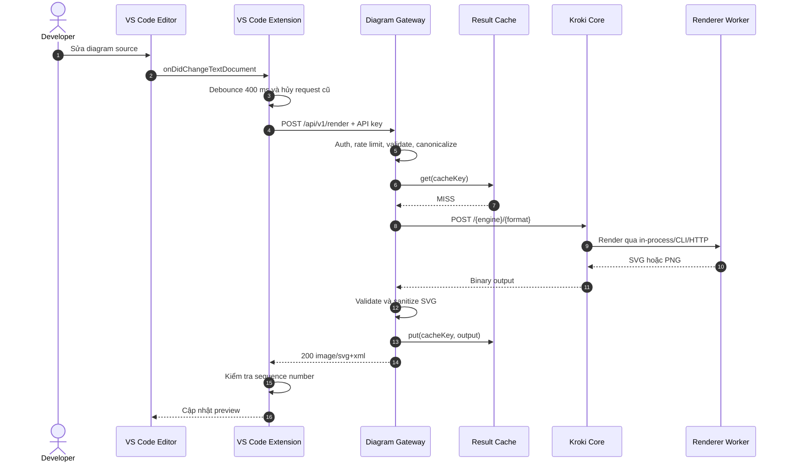

Nếu cache hit, Gateway trả ngay sau bước `get`. Nếu người dùng đã sửa source lần nữa, Extension bỏ response cũ dù request đã thành công.

### 4.2 Live preview có syntax error

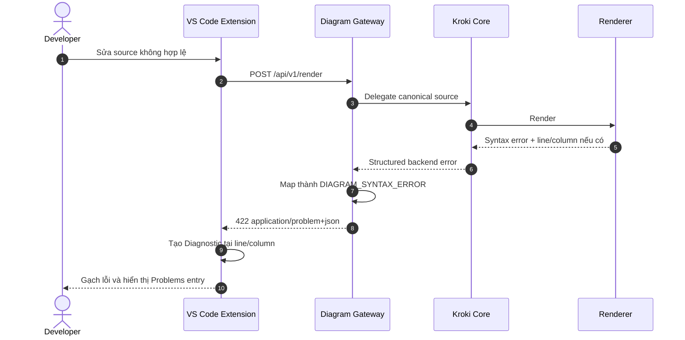

### 4.3 GitHub Action kiểm tra pull request bằng OIDC

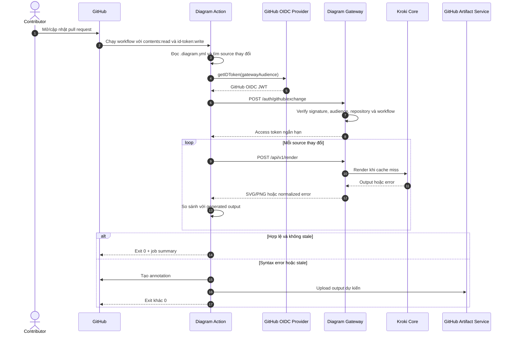

### 4.4 Timeout và quá tải

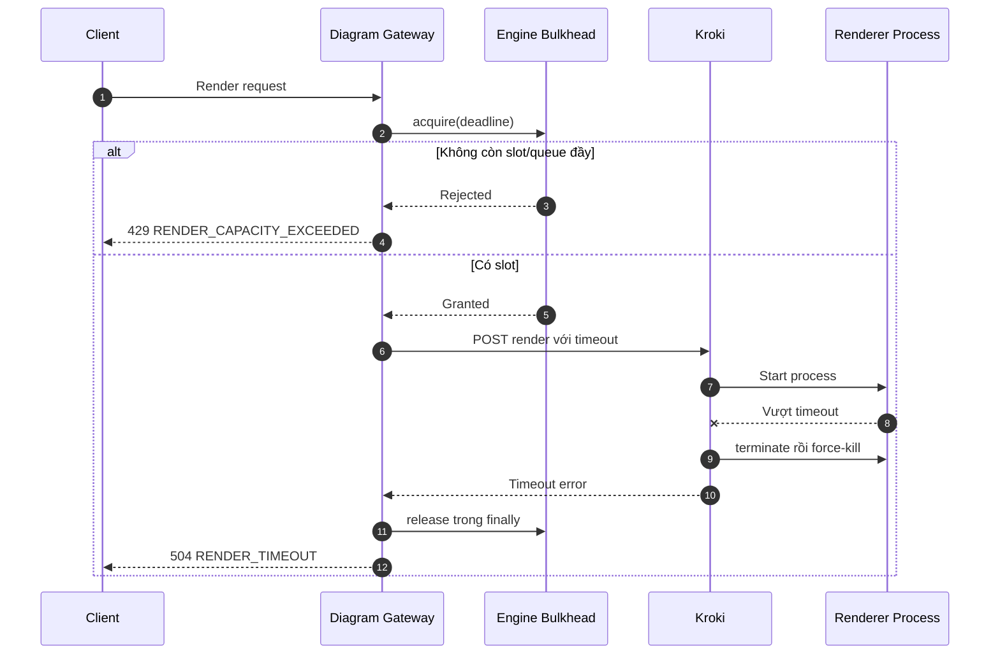

## 5. Data flow và API contract

Đặc tả máy đọc được của public API được lưu tại [`docs/openapi.yaml`](./openapi.yaml). File OpenAPI phải được cập nhật cùng mọi thay đổi route, parameter, request/response schema, status code, error code hoặc security requirement trong phần này.

### 5.1 Data flow tổng quát

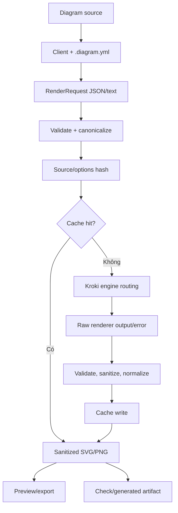

Diagram source chỉ tồn tại trong request memory, renderer stdin/body và cache key dưới dạng hash. Source không được ghi vào application log.

### 5.2 Render request JSON Schema

```json
{
  "$schema": "https://json-schema.org/draft/2020-12/schema",
  "$id": "https://diagram.example/schemas/render-request-v1.json",
  "title": "RenderRequest",
  "type": "object",
  "additionalProperties": false,
  "required": ["engine", "format", "source"],
  "properties": {
    "engine": {
      "type": "string",
      "enum": ["mermaid", "plantuml", "c4plantuml", "graphviz", "d2"]
    },
    "format": {
      "type": "string",
      "enum": ["svg", "png"]
    },
    "source": {
      "type": "string",
      "minLength": 1,
      "maxLength": 1048576
    },
    "options": {
      "type": "object",
      "additionalProperties": true,
      "properties": {
        "theme": { "type": "string", "maxLength": 64 }
      }
    },
    "cache": {
      "type": "object",
      "additionalProperties": false,
      "properties": {
        "mode": {
          "type": "string",
          "enum": ["default", "refresh", "no-store"],
          "default": "default"
        }
      }
    }
  }
}
```

`options` được mở cho engine-specific options nhưng Gateway phải áp allowlist theo engine; `additionalProperties: true` không đồng nghĩa mọi giá trị đều được chuyển xuống renderer.

Ví dụ request:

```json
{
  "engine": "mermaid",
  "format": "svg",
  "source": "graph TD\n  A --> B",
  "options": {
    "theme": "default"
  },
  "cache": {
    "mode": "default"
  }
}
```

### 5.3 Success response

Body thành công là binary, không bọc Base64 trong JSON.

```http
HTTP/1.1 200 OK
Content-Type: image/svg+xml
Content-Length: 1824
ETag: "sha256-4b0..."
Cache-Control: private, max-age=3600
X-Request-Id: req_01J...
X-Diagram-Engine: mermaid
X-Renderer-Version: 11.15.0
X-Cache: HIT
```

| Header | Bắt buộc | Mô tả |
|---|---|---|
| `Content-Type` | Có | MIME type theo format |
| `X-Request-Id` | Có | Correlation ID |
| `X-Diagram-Engine` | Có | Engine canonical |
| `X-Renderer-Version` | Có | Version tham gia tính cache/stale |
| `X-Cache` | Có | `HIT`, `MISS`, `BYPASS` |
| `ETag` | Có | Hash output cuối cùng |

### 5.4 Error response JSON Schema

Gateway dùng media type `application/problem+json` và giữ các field domain cần cho editor/CI.

```json
{
  "$schema": "https://json-schema.org/draft/2020-12/schema",
  "$id": "https://diagram.example/schemas/problem-v1.json",
  "title": "DiagramProblem",
  "type": "object",
  "additionalProperties": false,
  "required": ["type", "title", "status", "code", "message", "requestId"],
  "properties": {
    "type": { "type": "string", "format": "uri-reference" },
    "title": { "type": "string" },
    "status": { "type": "integer", "minimum": 400, "maximum": 599 },
    "code": { "type": "string", "pattern": "^[A-Z][A-Z0-9_]+$" },
    "message": { "type": "string" },
    "requestId": { "type": "string" },
    "engine": { "type": "string" },
    "line": { "type": "integer", "minimum": 1 },
    "column": { "type": "integer", "minimum": 1 },
    "retryAfterSeconds": { "type": "integer", "minimum": 0 }
  }
}
```

Ví dụ:

```json
{
  "type": "/problems/diagram-syntax-error",
  "title": "Diagram source không hợp lệ",
  "status": 422,
  "code": "DIAGRAM_SYNTAX_ERROR",
  "message": "Unexpected token near 'participant'",
  "requestId": "req_01JABCXYZ",
  "engine": "mermaid",
  "line": 12,
  "column": 8
}
```

### 5.5 Engine metadata response

```json
{
  "apiVersion": "v1",
  "engines": [
    {
      "id": "mermaid",
      "version": "11.15.0",
      "formats": ["svg", "png"],
      "available": true
    },
    {
      "id": "plantuml",
      "version": "1.2026.6",
      "formats": ["svg", "png"],
      "available": true
    }
  ]
}
```

### 5.6 `.diagram.yml` và JSON Schema

Schema máy đọc được đặt tại `product/packages/diagram-config/schema/diagram-config.schema.json`. VS Code Extension và GitHub Action cùng dùng parser, effective-settings resolver và output-path planner từ package `@diagram-as-code/diagram-config`; Gateway URL và credential không thuộc file cấu hình dự án.

Ví dụ cấu hình:

```yaml
version: 1

sources:
  - docs/diagrams/**/*.mmd
  - docs/diagrams/**/*.puml
  - docs/diagrams/**/*.plantuml
  - docs/diagrams/**/*.dot
  - docs/diagrams/**/*.d2

output: docs/generated-diagrams

defaults:
  format: svg
  theme: default

engines:
  graphviz:
    options:
      layout: dot
```

Schema rút gọn:

```json
{
  "$schema": "https://json-schema.org/draft/2020-12/schema",
  "$id": "https://diagram.example/schemas/diagram-config-v1.json",
  "type": "object",
  "additionalProperties": false,
  "required": ["version", "sources", "output"],
  "properties": {
    "version": { "const": 1 },
    "sources": {
      "type": "array",
      "minItems": 1,
      "uniqueItems": true,
      "items": { "type": "string", "minLength": 1 }
    },
    "output": { "type": "string", "minLength": 1 },
    "defaults": {
      "type": "object",
      "additionalProperties": false,
      "properties": {
        "format": { "enum": ["svg", "png"] },
        "theme": { "type": "string" }
      }
    },
    "engines": {
      "type": "object",
      "propertyNames": {
        "enum": ["mermaid", "plantuml", "c4plantuml", "graphviz", "d2"]
      },
      "additionalProperties": {
        "type": "object",
        "additionalProperties": false,
        "properties": {
          "format": { "enum": ["svg", "png"] },
          "theme": { "type": "string" },
          "options": { "type": "object" }
        }
      }
    }
  }
}
```

Gateway URL và credential cố ý không có trong schema này.

### 5.7 Output manifest cho stale check

Action có thể tạo manifest để phát hiện thay đổi renderer/config mà chỉ so byte khó giải thích:

```json
{
  "schemaVersion": 1,
  "entries": {
    "docs/diagrams/architecture.mmd": {
      "output": "docs/generated-diagrams/architecture.svg",
      "engine": "mermaid",
      "format": "svg",
      "sourceSha256": "f9f9...",
      "optionsSha256": "c13a...",
      "rendererVersion": "11.15.0",
      "outputSha256": "4b0a..."
    }
  }
}
```

Manifest là `Should`; MVP vẫn có thể render lại và so output hash trực tiếp.

## 6. Architecture Decision Records

### ADR-001 - Tách Diagram Gateway khỏi Kroki

| Mục | Nội dung |
|---|---|
| Trạng thái | Accepted |
| Bối cảnh | Kroki đã có API và engine registry nhưng SRS yêu cầu auth, rate limit, cache tenant, error contract và client-specific policy. |
| Quyết định | Xây Gateway thành container/service riêng; Kroki chỉ là internal rendering backend. |
| Lý do | Giữ fork nhỏ, tách vòng đời sản phẩm khỏi upstream, một policy layer cho mọi client. |
| Đánh đổi | Thêm một network hop và một service phải deploy/monitor. |
| Hệ quả | Kroki không expose công khai; Gateway chịu trách nhiệm API versioning và backward compatibility. |

### ADR-002 - Fork tối thiểu Kroki Java thay vì viết rendering orchestrator mới

| Mục | Nội dung |
|---|---|
| Trạng thái | Accepted |
| Bối cảnh | Repository hiện tại đã có Vert.x registry, command execution, companion delegation và nhiều engine đã kiểm thử. |
| Quyết định | Duy trì fork Kroki Java, pin upstream commit/version và chỉ patch security, metadata, errors, resource control. |
| Lý do | Giảm rủi ro tích hợp renderer và tập trung công sức vào Gateway/toolchain là phần khác biệt. |
| Đánh đổi | Phải theo dõi upstream và giữ compatibility với cấu trúc Kroki. |
| Hệ quả | Mọi patch fork cần changelog, test và lý do không thể xử lý ngoài Kroki. |

### ADR-003 - Dùng HTTP đồng bộ thay vì message queue

| Mục | Nội dung |
|---|---|
| Trạng thái | Accepted cho MVP |
| Bối cảnh | Live preview và CI cần kết quả ngay, timeout mặc định 15 giây; không có yêu cầu batch dài hoặc durable jobs. |
| Quyết định | Gateway gọi Kroki qua HTTP request-response; Kroki gọi companion qua HTTP hoặc local process API. |
| Lý do | Đơn giản hóa deployment, cancellation, error propagation và latency. |
| Đánh đổi | Request giữ connection trong thời gian render; cần bulkhead và timeout chặt. |
| Hệ quả | Chỉ xem xét queue khi có workload batch dài, callback/job API hoặc nhu cầu durable scheduling. |

### ADR-004 - Mô hình renderer hybrid thay vì container-per-engine tuyệt đối

| Mục | Nội dung |
|---|---|
| Trạng thái | Accepted cho MVP |
| Bối cảnh | PlantUML tích hợp JVM; Graphviz/D2 phù hợp child process; Mermaid cần Chromium và đã là companion service. |
| Quyết định | PlantUML, Graphviz và D2 ở `kroki-core` theo bounded executors; Mermaid ở companion container riêng. |
| Lý do | Bám mô hình Kroki hiện có, giảm số image/service và tránh deep fork. |
| Đánh đổi | Resource isolation của local engines ở mức process/container chung, không độc lập hoàn toàn. |
| Hệ quả | Đặt per-engine semaphore; có thể tách Graphviz/D2 thành worker HTTP khi số liệu vận hành chứng minh cần thiết. |

### ADR-005 - In-memory cache cho MVP, Redis qua adapter

| Mục | Nội dung |
|---|---|
| Trạng thái | Accepted |
| Bối cảnh | MVP self-hosted cần setup gọn nhưng SRS yêu cầu cache và khả năng scale ngang. |
| Quyết định | `ResultCache` port với in-memory LRU adapter mặc định; Redis adapter là `Should`. |
| Lý do | Cache hit nhanh, không thêm dependency vận hành, phù hợp single-instance MVP. |
| Đánh đổi | Nhiều Gateway instance không chia sẻ cache và rate-limit state nếu chưa có Redis. |
| Hệ quả | Cache key/entry không phụ thuộc implementation in-memory; deployment guide phải nói rõ semantics multi-instance. |

### ADR-006 - Binary success và structured JSON error

| Mục | Nội dung |
|---|---|
| Trạng thái | Accepted |
| Bối cảnh | SVG/PNG không cần Base64 overhead; editor/CI cần lỗi có machine-readable fields. |
| Quyết định | Thành công trả binary đúng MIME; lỗi trả `application/problem+json`. |
| Lý do | Hiệu quả mạng và tương thích trực tiếp với image/file workflows. |
| Đánh đổi | Client phải xử lý hai response shape theo status/content type. |
| Hệ quả | SDK/GatewayClient chung phải kiểm tra status trước khi đọc body. |

### ADR-007 - `.diagram.yml` là contract dự án, JSON Schema là nguồn sự thật

| Mục | Nội dung |
|---|---|
| Trạng thái | Accepted |
| Bối cảnh | VS Code và GitHub Action phải lập output path và options giống nhau. |
| Quyết định | Một `.diagram.yml`; parser/path planner dùng chung trong TypeScript package; JSON Schema version hóa. |
| Lý do | Tránh config drift giữa local và CI. |
| Đánh đổi | Thay đổi schema cần migration và backward compatibility. |
| Hệ quả | Gateway URL/API key vẫn ở client settings/secrets, không đặt trong project config. |

### ADR-008 - Một authentication service với nhiều authenticator

| Mục | Nội dung |
|---|---|
| Trạng thái | Accepted; OIDC là `Should` |
| Bối cảnh | VS Code cần no-auth/API key; GitHub public fork hưởng lợi từ OIDC. |
| Quyết định | Authenticator chain tạo một `Principal` chung; downstream authorization/rate/cache chỉ biết principal. |
| Lý do | Không lặp auth pipeline và cho phép thêm credential type mà không đổi render core. |
| Đánh đổi | Phải duy trì verifier và policy riêng cho từng credential format. |
| Hệ quả | API key triển khai MVP; OIDC adapter/exchange bổ sung mà không thay contract render. |

### ADR-009 - SVG là format mặc định và phải sanitize tại trust boundary

| Mục | Nội dung |
|---|---|
| Trạng thái | Accepted |
| Bối cảnh | SVG phù hợp tài liệu và zoom nhưng có thể chứa script, external link hoặc active content. |
| Quyết định | SVG là default; Gateway sanitize trước cache và response. |
| Lý do | Một điểm kiểm soát chung cho VS Code, GitHub và API consumer. |
| Đánh đổi | Sanitizer có thể loại một số tính năng SVG hợp lệ và thêm CPU cost. |
| Hệ quả | Sanitizer version tham gia cache key; test cần có malicious SVG corpus. |

### ADR-010 - Generated output được commit; Action mặc định chỉ kiểm tra

| Mục | Nội dung |
|---|---|
| Trạng thái | Accepted |
| Bối cảnh | README cần URL ảnh ổn định; artifact có vòng đời hữu hạn; PR fork không nên có quyền ghi. |
| Quyết định | SVG generated được commit cùng source; Action `check` phát hiện stale; auto-commit chỉ là tùy chọn trusted branch. |
| Lý do | Hiển thị được ở mọi nơi trên Git và giữ PR an toàn. |
| Đánh đổi | Repository có generated files và thay đổi binary/text SVG trong commit. |
| Hệ quả | VS Code render-on-save/export và CLI/Action generate phải cho output deterministic. |

### ADR-011 - Dùng Fastify/TypeScript cho Diagram Gateway

| Mục | Nội dung |
|---|---|
| Trạng thái | Accepted |
| Ngày | 2026-07-22 |
| Bối cảnh | Gateway là service độc lập với Kroki và có nhiều contract dùng chung với VS Code Extension, GitHub Action và package cấu hình. Việc dùng cùng runtime Java với Kroki không phải ràng buộc sản phẩm hay giao thức. |
| Quyết định | Diagram Gateway dùng Node.js 24, TypeScript và Fastify 5. Kroki fork vẫn dùng Java 25/Vert.x và chỉ được truy cập qua HTTP nội bộ. |
| Lý do | Chia sẻ type/schema với toolchain TypeScript, giảm số implementation language ở lớp sản phẩm, giữ vòng lặp build/test nhanh và không làm tăng coupling với Kroki. |
| Đánh đổi | Deployment có hai runtime; nhóm phải duy trì quy ước observability và deadline propagation nhất quán giữa Node.js và Java. |
| Hệ quả | Source Gateway đặt tại `product/gateway`; cache MVP dùng adapter in-memory phù hợp Node.js; mọi đề cập Java/Vert.x cho Gateway bị thay thế. ADR này không thay đổi public API, trách nhiệm Gateway hoặc chiến lược fork tối thiểu. |

## 7. Traceability từ SRS đến thiết kế

| Nhóm SRS | Thành phần thiết kế |
|---|---|
| FR-001 đến FR-014 | HTTP API, Request Normalizer, Cache Service, Render Orchestrator, Error Mapper |
| FR-020 đến FR-028 | Authentication Service, Policy Authorizer, Rate Limiter |
| FR-030 đến FR-039 | Kroki fork, engine adapters, companion worker, process pool |
| FR-040 đến FR-046 | Shared configuration package và JSON Schema |
| FR-050 đến FR-064 | VS Code Extension components và preview sequence |
| FR-070 đến FR-082 | GitHub Action components và PR sequence |
| FR-090 đến FR-095 | Docker deployment, health model và observability |
| NFR-PERF | Body guards, token bucket, bulkheads, timeout và cache |
| NFR-SEC | Auth chain, network boundary, secure renderers, SVG sanitizer và no-source logging |
| NFR-SCL | Pluggable cache/rate store, stateless Gateway và backend replicas |
| NFR-AVL | Readiness, per-engine isolation, timeout và cache degradation |

## 8. Cấu hình triển khai đề xuất

| Biến | Mặc định | Mô tả |
|---|---|---|
| `HOST` / `PORT` | `0.0.0.0` / `9000` | Địa chỉ Gateway |
| `DEPLOYMENT_PROFILE` | `local` | `local` hoặc `production` |
| `AUTH_MODE` | `required` | `required` hoặc `disabled`; production non-loopback không được disabled |
| `DIAGRAM_API_KEY_RECORDS` | Không có | JSON verifier records gồm ID, SHA-256 verifier, scopes, cache partition và status |
| `MAX_SOURCE_BYTES` | `1048576` | Source tối đa sau decode, tối đa cấu hình 10 MiB |
| `MAX_OUTPUT_BYTES` | `10485760` | Output tối đa, tối đa cấu hình 50 MiB |
| `RENDER_TIMEOUT_MS` | `15000` | Deadline render, từ 5 đến 60 giây |
| `RENDER_MAX_CONCURRENT` | `4` | Global bulkhead, từ 1 đến 64 |
| `RENDER_MAX_QUEUE` | `20` | Pending render queue, từ 0 đến 1000 |
| `RATE_LIMIT_PER_MINUTE` | `60` | Token refill theo principal |
| `RATE_LIMIT_BURST` | `10` | Token bucket capacity |
| `CACHE_MAX_ENTRIES` | `500` | Số entry tối đa của LRU cache in-memory |
| `RENDERER_VERSION` | `kroki-0.31.1` | Tham gia cache key |
| `SANITIZER_VERSION` | `svg-sanitizer-1` | Tham gia cache key |
| `METRICS_ENABLED` | `true` | Có đăng ký `/metrics` hay không |
| `LOG_LEVEL` | `info` | Mức Pino/Fastify log |
| `KROKI_BASE_URL` | `http://kroki:8000` | Internal backend URL |

Production profile phải fail fast nếu bật no-auth trên non-loopback interface, nếu thiếu OIDC audience khi bật OIDC, hoặc nếu cấu hình backend URL dùng public/untrusted scheme không được allowlist.

## 9. Kiểm thử kiến trúc tối thiểu

Kế hoạch kiểm thử chi tiết, môi trường tham chiếu và danh sách test case nghiệm thu được duy trì tại [docs/TestPlan.md](TestPlan.md).

| Loại kiểm thử | Phạm vi |
|---|---|
| Contract | JSON Schema, content type, status code, headers và backward compatibility. |
| Gateway unit | Authenticator, canonicalization, cache key, rate limiter và error mapping. |
| Renderer integration | Mermaid, PlantUML/C4, Graphviz và D2 với valid/invalid source. |
| Security | Oversized/compressed input, remote include, command injection, malicious SVG và credential redaction. |
| Concurrency | Bulkhead đầy, queue đầy, single-flight và process timeout/kill. |
| VS Code E2E | Unsaved preview, stale response, diagnostic, export và SecretStorage. |
| GitHub Action E2E | Check pass/fail, stale output, artifact, API key và OIDC policy. |
| Deployment smoke | Docker Compose, health/readiness và chỉ Gateway được expose. |

## 10. Điểm cần xác nhận trước implementation

| ID | Nội dung cần xác nhận | Đề xuất hiện tại |
|---|---|---|
| OPEN-01 | Runtime của Gateway và Kroki | Đã chốt bởi ADR-011: Node.js 24 cho Gateway, Java 25 cho Kroki |
| OPEN-02 | API key store MVP | Mounted secret/config + admin CLI, không thêm database |
| OPEN-03 | OIDC có vào MVP hay bản kế tiếp | Bản kế tiếp (`Should`) theo SRS |
| OPEN-04 | Redis có cần trong demo | Không; in-memory LRU đủ cho single-instance MVP |
| OPEN-05 | Có bắt buộc PDF trong MVP | Không; SVG/PNG trước |
| OPEN-06 | Generated manifest có commit hay không | `Should`; MVP có thể render và so hash trực tiếp |
